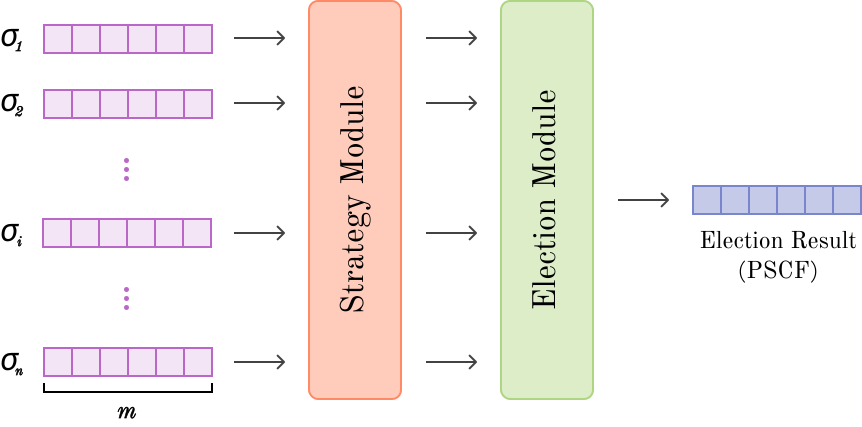
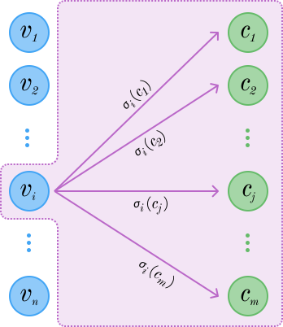

# Learning Robust Voting Rules with Adversarial Graph Neural Networks

This repository contains the codebase for automated discovery of welfare-maximising voting rules with graph neural networks. Our method enforces
- Voter **anonymity**
- Candidate **neutrality**
- Mechanism **monotonicity**
- **Generalisation** to an arbitrary number of voter and candidates
- **Robustness** to strategic voting

     &nbsp;&nbsp;&nbsp;&nbsp; 

*Elections are an indispensable tool for achieving consensus in the face of conflicting motives, with applications from recommender systems and peer-to-peer networks to real-world representative democracy. However, there does not exist a desirable universal voting rule satisfying all scenarios, and the design of these systems is at the forefront of mechanism design research. Automated mechanism design is a promising approach and work has demonstrated that set-invariant architectures are uniquely suited to modelling electoral systems. However, various concerns prevent the direct application to real-world settings---importantly robustness to strategic voting. In this project, we generalise the expressive capability of learned voting rules, and combine improvements in neural network architecture with adversarial training to improve the robustness of voting rules while maximising social welfare. We then test our methods on synthetic and real-world datasets. Our method resolves critical limitations of prior work around learning voting rules, and can enable practioners to apply machine learning to elections in real-world settings.*

## Setup

We use [uv](https://docs.astral.sh/uv/) for dependency management. After installation, first run `uv sync` to install all required packages. 

Enter the virtual environment by running `. .venv/bin/activate`.

Pytorch scatter will need to then be manually installed, with `uv pip install torch-scatter -f https://data.pyg.org/whl/torch-2.5.0+cu124.html`.

## Experiments

To manually download datasets, see the README file in the data folder.

To run experiments, go into the relevant experiments folder, and run `uv run python main.py`. Configurations and sweeps are managed using [hydra](https://hydra.cc/docs/1.3/intro/).

Preconfigured sweeps can be run by going into the relevant experiments folder, and running `./sweeps/SWEEP_NAME.sh`.

Experiments include **learning voting rules** (experiments/learn_voting_rules), **maximising welfare** (experiments/maximise_welfare), and **strategic voting** (experiments/strategic_voting).
